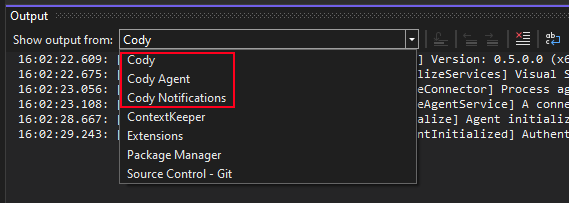

## Troubleshooting Cody for Visual Studio extension

### Access Cody logs

Visual Studio logs can be accessed via the **Output** panel. To access logs:

- Open `View -> Output` from the main menu
- Select `Cody` output pane

### Autocomplete

Cody autocomplete for Visual Studio uses the underlying VS API to display completions in the editor. It's turned on by default in VS (`Tools -> Options -> IntelliCode -> Show Inline Completions`). Without this setting enabled, autocomplete will not work, so this is the first thing to check.

Also make sure that `Tools -> Options -> Cody -> Automatically trigger completions` is turned on (it is by default). 

Autocomplete is supported from Visual Studio 17.6+ and includes support for the following languages:

1. C/C++/C#
2. Python
3. JavaScript/TypeScript/TSX
4. HTML
5. CSS
6. JSON

#### Non-trusted certificates

If autocomplete still doesn't work (or the Cody Chat), you could try **turning on** the option to `accept non-trusted certificates` (requires Visual Studio restart). This should help, especially in enterprise settings if you are behind a firewall.

### Detailed debugging logs

The detailed logging configuration can be turned on by adding the `CODY_VS_DEV_CONFIG` environment variable containing the full path to [the configuration file](https://github.com/sourcegraph/cody-vs/blob/main/src/CodyDevConfig.json) placed somewhere in the filesystem.

Two additional output panes, `Cody Agent` and `Cody Notifications`, will be created with more detailed logs. More information on how to configure them is available [here](https://github.com/sourcegraph/cody-vs/blob/main/CONTRIBUTING.md#developer-configuration-file).

